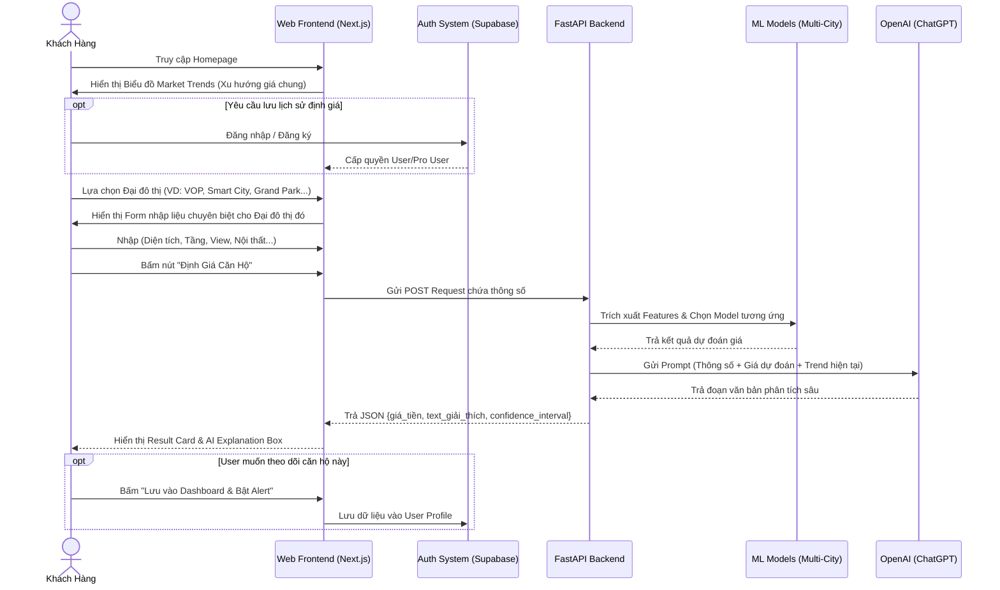
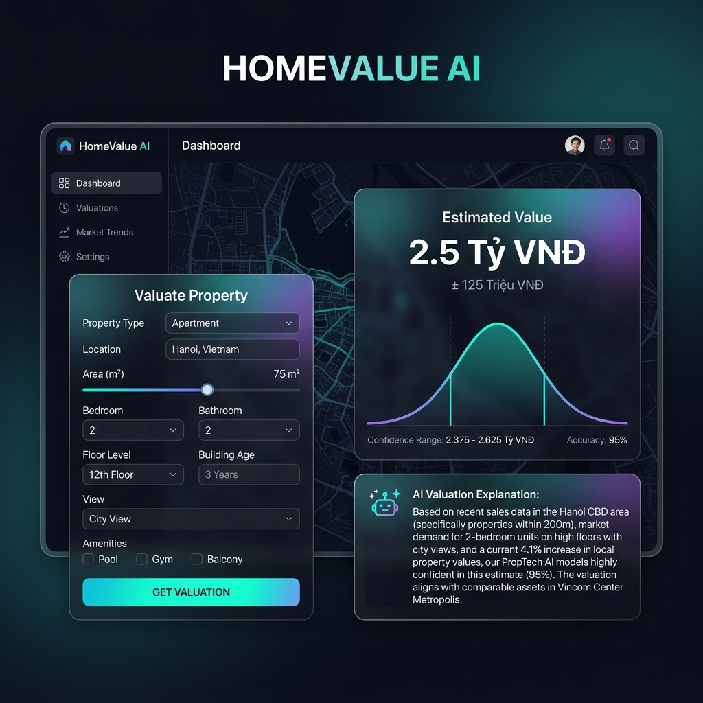

# Wireframe & UI Flow (Full Project)

**Dự án:** AI Định Giá Căn Hộ Đại Đô Thị (HomeValue AI)  
**Tầm nhìn:** Nền tảng PropTech toàn diện dành cho mọi Đại đô thị tại Việt Nam.

---

## 1. Sơ Đồ Luồng Người Dùng (Full User Flow)
Sơ đồ dưới đây mô tả luồng thao tác hoàn chỉnh của người dùng trong hệ thống thực tế (bao gồm cả các tính năng đăng nhập, theo dõi lịch sử và phân tích thị trường).

## 2. Đặc Tả Giao Diện Các Màn Hình Chính (Wireframes)

Ứng dụng được thiết kế theo phong cách Dark Mode chuyên nghiệp, tối giản (Minimalism) và tập trung vào dữ liệu trực quan (Data-driven).

### Màn hình 1: Homepage & Market Trends (Trang chủ)
- **Header:** Logo HomeValue AI, Navigation bar (Định giá, Phân tích thị trường, Quản lý tài sản), Nút Đăng nhập.
- **Hero Section:** Thanh tìm kiếm cực lớn ở giữa màn hình (Ví dụ: "Nhập tên khu đô thị bạn quan tâm...").
- **Body:** 
  - Hiển thị Biểu đồ Line Chart so sánh xu hướng giá m2 của các đại đô thị lớn trong 6 tháng qua.
  - Danh sách Top các khu đô thị đang có lượng giao dịch và quan tâm cao nhất.

### Màn hình 2: AI Valuation Dashboard (Lõi Định Giá)
Đây là màn hình cốt lõi nhất của hệ thống, được chia làm 2 phân khu hiển thị (Split-screen).
- **Khu vực trái (Input Panel):**
  - Dropdown: Chọn Đại đô thị (sẽ filter các phân khu tương ứng bên dưới).
  - Form linh hoạt: Phân khu, Diện tích, Số tầng, View, Nội thất.
  - Button Action: "Get Valuation" (Hiệu ứng Gradient nổi bật).
- **Khu vực phải (Output Panel):**
  - Text lớn hiển thị giá trị dự đoán (Ví dụ: **2.5 Tỷ VNĐ**).
  - Biểu đồ phân bố (Bell Curve) hiển thị khoảng tin cậy (Confidence Range) để giúp người dùng hiểu rằng giá dao động theo cung cầu.
  - Khối **AI Explanation**: Gắn kèm icon AI, chứa đoạn text giải thích rành mạch tại sao căn hộ này lại có giá đó.

### Màn hình 3: User Dashboard & Tracking (Quản Lý Tài Sản)
- **Menu Trái:** Thông tin Profile, Danh sách Bất động sản đang theo dõi, Cài đặt thông báo.
- **Màn hình chính:** 
  - Danh sách dạng thẻ (Cards) các căn hộ người dùng đã từng định giá.
  - Hiển thị nhãn xanh/đỏ báo hiệu: "Giá căn này đã tăng 5% so với tháng trước".
  - Nút "Export Báo cáo PDF" dành riêng cho tài khoản Pro (Môi giới).

## 3. Bản Vẽ Trực Quan Minh Hoạ (UI Mockup Core Feature)
Hình ảnh dưới đây phác thảo trực quan Màn hình 2 (AI Valuation Dashboard) - trái tim của toàn bộ dự án, minh họa rõ sự chuyên nghiệp trong khâu phân tích dữ liệu và AI.

