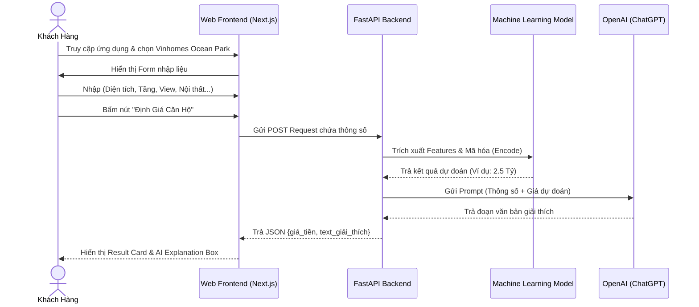

# Wireframe & UI Flow

**Dự án:** AI Định Giá Căn Hộ Đại Đô Thị  

---

## 1. Bản Vẽ Trực Quan (UI Mockup)
Dưới đây là bản vẽ phác thảo giao diện Web App cho MVP, được thiết kế theo phong cách Dark Mode hiện đại, chuyên nghiệp dành cho PropTech.

## 2. Sơ Đồ Luồng Người Dùng (User Flow)
Luồng thao tác từ lúc người dùng (Cư dân/Môi giới) truy cập web cho đến khi nhận được kết quả định giá AI.

## 3. Đặc Tả Giao Diện (Wireframe Description)

Giao diện (như hình Mockup) được chia làm 2 phân khu chính để tối ưu hóa trải nghiệm trên một màn hình duy nhất (Single Page Dashboard).

### Khu vực trái: Input Panel (Form Nhập Liệu)
- **Style:** Glassmorphism, bo góc mềm mại.
- **Components:**
  - Dropdown chọn Phân khu (Sapphire, Zenpark...).
  - Input số: Diện tích.
  - Dropdown: Tầm view (Nội khu, Hồ...).
  - Button Action: "Get Valuation" (Hiệu ứng Gradient Teal nổi bật).

### Khu vực phải: Output Panel (Dashboard Kết Quả)
- **Top Card (Giá Trị Cốt Lõi):**
  - Text siêu to khổng lồ hiển thị giá trị dự đoán: **2.5 Tỷ VNĐ**.
  - Bên dưới là đồ thị hình chuông (Bell Curve) hiển thị khoảng tin cậy (Confidence Range) để giúp người dùng hiểu rằng giá nhà dao động theo cung cầu.
- **Bottom Card (Explainable AI):**
  - Chứa logo Robot AI nhỏ báo hiệu đây là text tự sinh.
  - Box nội dung: Giải thích rành mạch tại sao căn hộ này lại có giá đó (ví dụ: nhờ view đẹp, thiết kế cao cấp của Zenpark...).
